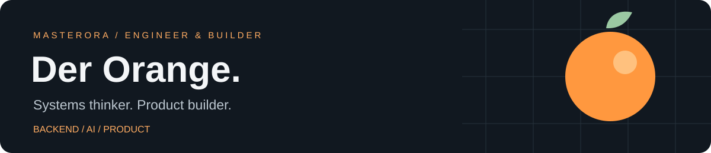

<picture>
  
</picture>

**后端工程 × AI 系统 × 产品创造**

让复杂性留在系统里，让确定性交到用户手上。

  

### About me

我是 **Der_Orange**，一名以系统思维构建产品的开发者。

以 **Go / Python** 为工程底座，向下深入服务架构、数据一致性与运行可靠性，向上打通 **Agent 编排、知识检索与产品交互**。从需求拆解、架构设计到端到端实现，把想法推进为完整的软件。

我关心每一次调用背后的权限，每一次状态变化背后的约束，以及每一个结果背后的证据。**让系统经得起追问，也经得起失败。**

### Engineering DNA

**01 / Think in systems** 
从业务约束出发，理解数据、状态与边界，设计能够演进的架构。

**02 / Build AI with control** 
把模型能力放进清晰的工程边界：工具受控、结果可核查、过程可观测。

**03 / Own the whole loop** 
贯通后端、界面与交付。代码之外，同样重视用户体验、运行方式和验证依据。

### Technical ground

| 方向 | 技术与关注点 |
| :--- | :--- |
| **Backend & Systems** | Go · Python · API 设计 · 异步任务 · 幂等与一致性 |
| **AI Engineering** | Agent · RAG · LangGraph · 工具编排 · 评估与可观测性 |
| **Data & Infrastructure** | PostgreSQL · Redis · 消息队列 · 向量检索 · Docker |
| **Product Development** | TypeScript · React · 交互设计 · 端到端交付 |

  <strong>Think deeply. Build precisely. Ship deliberately.</strong> 
  保持好奇，深入原理，用作品表达判断。

