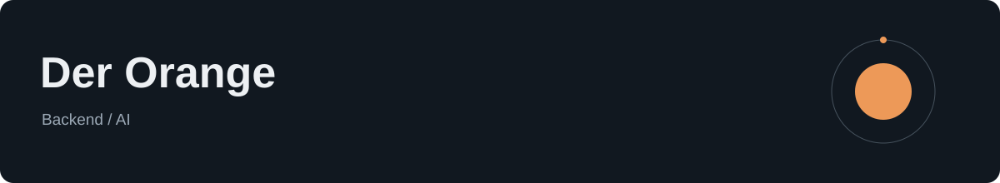

主要写 Go 和 Python，做后端服务与 AI 应用，也用 TypeScript / React 开发界面。

关注 Agent 工具编排、知识检索，以及服务的状态管理和故障恢复。

**后端** · Go / Python / PostgreSQL / Redis 
**AI** · RAG / LangGraph / 向量检索 
**界面与部署** · TypeScript / React / Docker
